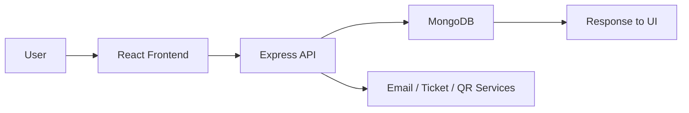

# Eventra

    

Eventra is a full-stack event booking and management platform for organizers and attendees. It helps people discover events, register securely, receive tickets and QR codes, and manage their profiles, while admins can create, edit, delete, and analyze events with participant and attendance workflows.

## Table of Contents

- [Features](#features)
- [Tech Stack](#tech-stack)
- [Project Architecture](#project-architecture)
- [How It Works](#how-it-works)
- [Installation](#installation)
- [Environment Variables](#environment-variables)
- [API Documentation](#api-documentation)
- [Database](#database)
- [Authentication](#authentication)
- [Screenshots](#screenshots)
- [Folder Structure](#folder-structure)
- [Configuration](#configuration)
- [Performance Features](#performance-features)
- [Security Features](#security-features)
- [Future Improvements](#future-improvements)
- [Contributing](#contributing)
- [License](#license)
- [Author](#author)
- [Acknowledgements](#acknowledgements)

## Features

### Attendee Experience

- ✅ Browse and search public events
- ✅ View event details, categories, and availability
- ✅ Register for events with seat-count handling
- ✅ View personal registrations and tickets
- ✅ Download or view QR-based tickets
- ✅ Manage profile, avatar, password, and theme preferences

### Organizer and Admin Experience

- ✅ Create, edit, and delete events
- ✅ Manage participant lists for each event
- ✅ Remove participants and adjust registration state
- ✅ Verify attendance with QR code check-in
- ✅ Review attendance summaries and event analytics
- ✅ Export participant data as CSV and generate PDF reports

### Platform Capabilities

- ✅ JWT-based authentication and role-based access
- ✅ Redis-backed caching for event list/details
- ✅ Rate limiting for auth and event actions
- ✅ File uploads for event images and avatars
- ✅ Email notifications for registration and ticket actions
- ✅ Responsive UI with toast feedback and protected routes

## Tech Stack

### Frontend

- React 18
- Vite
- React Router DOM
- Axios
- React Hot Toast
- React Icons
- Tailwind CSS (configured)

### Backend

- Node.js
- Express.js
- MongoDB with Mongoose
- JWT for authentication
- bcryptjs for password hashing
- Multer for file uploads
- QR code generation and PDF/CSV export support

### Database

- MongoDB
- Mongoose schemas for users, events, registrations, tickets, and attendance

### Authentication

- JWT bearer tokens
- Role-based access with user/admin roles

### State Management

- React context for authentication and theme state

### Styling

- CSS modules and component-level styles
- Tailwind CSS configuration is present

### APIs

- RESTful API layer with Axios on the frontend
- Protected and public route handling on the backend

### Libraries

- Resend / SMTP-based email support
- QRCode generation
- pdfkit for PDF generation
- compression, helmet, cors

### Deployment

- Backend is designed to run as a Node service
- Frontend is built as a Vite app
- Production deployment targets are not enforced in the repo

### Dev Tools

- Vite dev server
- Nodemon for backend development
- PostCSS and Autoprefixer

## Project Architecture

The project is split into two main parts:

- Backend: API, authentication, data models, file uploads, scheduled jobs, and reporting
- Frontend: React pages, shared components, context providers, and API services

```text
backend/
  config/
  controllers/
  middleware/
  models/
  routes/
  utils/
  uploads/
frontend/
  src/
    components/
    context/
    pages/
    services/
    styles/
    utils/
```

### What each major folder does

- backend/config: database, Redis, and email configuration
- backend/controllers: business logic for auth, events, registrations, tickets, attendance, dashboard, and participants
- backend/models: MongoDB schemas for users, events, registrations, tickets, and attendance
- backend/routes: API endpoints grouped by domain
- backend/utils: QR code generation, email helpers, ticket creation, PDF/CSV reporting, cron jobs
- frontend/src/pages: route-level pages such as Home, MyTickets, AdminDashboard, and attendance tools
- frontend/src/components: shared UI pieces such as Navbar, EventCard, QRCodeDisplay, and ProtectedRoute
- frontend/src/services: centralized Axios API helpers
- frontend/src/context: authentication and theme state providers

## How It Works

The app follows a simple end-to-end flow:



1. Users visit the frontend and browse public events.
2. Authenticated users can register, view tickets, and manage their profile.
3. The frontend sends requests to the Express API.
4. The backend validates access, updates MongoDB records, and generates tickets or reports.
5. Admins can verify attendance through QR-based check-in and export participant reports.

## Installation

### Prerequisites

- Node.js 18+ recommended
- MongoDB instance (local or Atlas)
- npm

### Clone and install

```bash
git clone <repository-url>
cd eventbooking

cd backend
npm install
cp .env.example .env

cd ../frontend
npm install
```

### Run locally

Start the backend in one terminal:

```bash
cd backend
npm run dev
```

Start the frontend in another terminal:

```bash
cd frontend
npm run dev
```

The API should be available at http://localhost:5000 and the frontend at http://localhost:3000.

### Production build

```bash
cd frontend
npm run build
```

## Environment Variables

Create a backend environment file before running the app.

| Variable                 | Description                       | Required |
| ------------------------ | --------------------------------- | -------- |
| PORT                     | Backend port                      | Yes      |
| NODE_ENV                 | Runtime environment               | No       |
| MONGODB_URI              | MongoDB connection string         | Yes      |
| JWT_SECRET               | Secret key for JWT signing        | Yes      |
| JWT_EXPIRE               | JWT expiration period             | No       |
| EMAIL_SERVICE            | Email provider name               | No       |
| EMAIL_USER               | Sender email address              | No       |
| EMAIL_PASSWORD           | Sender password or app password   | No       |
| SMTP_HOST                | SMTP host override                | No       |
| SMTP_PORT                | SMTP port override                | No       |
| SMTP_USER                | SMTP username                     | No       |
| SMTP_PASSWORD            | SMTP password                     | No       |
| RESEND_API_KEY           | Resend API key for email delivery | No       |
| EMAIL_FROM               | From address for outgoing email   | No       |
| FRONTEND_URL             | Allowed frontend origin for CORS  | No       |
| UPSTASH_REDIS_REST_URL   | Redis URL for caching             | No       |
| UPSTASH_REDIS_REST_TOKEN | Redis token for caching           | No       |

## API Documentation

### Core endpoints

| Method | Endpoint                            | Description                              | Authentication       |
| ------ | ----------------------------------- | ---------------------------------------- | -------------------- |
| POST   | /api/auth/register                  | Register a new user                      | Public               |
| POST   | /api/auth/login                     | Log in and receive a JWT                 | Public               |
| GET    | /api/auth/me                        | Get current user profile                 | Bearer token         |
| GET    | /api/events                         | Get paginated, searchable event listings | Public               |
| GET    | /api/events/:id                     | Get single event details                 | Public               |
| POST   | /api/events                         | Create a new event                       | Bearer token + admin |
| PUT    | /api/events/:id                     | Update an event                          | Bearer token         |
| DELETE | /api/events/:id                     | Delete an event                          | Bearer token         |
| POST   | /api/registrations                  | Register the current user for an event   | Bearer token         |
| GET    | /api/registrations/my-registrations | List current user registrations          | Bearer token         |
| DELETE | /api/registrations/:id              | Cancel a registration                    | Bearer token         |
| POST   | /api/attendance/check-in            | Validate a QR ticket and check in        | Bearer token         |
| GET    | /api/participants/event/:eventId    | List participants for an event           | Bearer token         |
| GET    | /api/dashboard/analytics            | Get admin dashboard analytics            | Bearer token + admin |

### Example requests

Register:

```bash
curl -X POST http://localhost:5000/api/auth/register \
  -H "Content-Type: application/json" \
  -d '{"fullName":"Ava","email":"ava@example.com","password":"secret123","confirmPassword":"secret123"}'
```

Create an event (admin):

```bash
curl -X POST http://localhost:5000/api/events \
  -H "Authorization: Bearer <token>" \
  -F "name=AI Summit" \
  -F "description=Community meetup" \
  -F "category=conference" \
  -F "date=2026-08-01T10:00" \
  -F "location=Mumbai" \
  -F "capacity=200"
```

Check in with QR:

```bash
curl -X POST http://localhost:5000/api/attendance/check-in \
  -H "Authorization: Bearer <token>" \
  -H "Content-Type: application/json" \
  -d '{"qrCode":"<qr-or-ticket-value>","eventId":"<event-id>"}'
```

## Database

The backend uses MongoDB with Mongoose models.

| Collection / Model | Purpose                                                                 | Key Relationships                                             |
| ------------------ | ----------------------------------------------------------------------- | ------------------------------------------------------------- |
| User               | Stores account information, role, password hash, profile, and theme     | Related to events, registrations, tickets, and attendance     |
| Event              | Stores event metadata such as name, category, date, capacity, and image | Created by a User, referenced by Registrations and Attendance |
| Registration       | Tracks attendee sign-ups and status                                     | Links User to Event and optionally to Ticket                  |
| Ticket             | Stores ticket number, QR payload, status, and validity                  | Linked to Registration                                        |
| Attendance         | Stores attendance check-in and checkout records                         | Linked to Registration, Event, User, and Ticket               |

### Relationships

- One User can create many Events.
- One User can register for many Events.
- One Event can have many Registrations.
- Each Registration can optionally generate one Ticket.
- Each Ticket can be used to create Attendance records during check-in.

## Authentication

Authentication is handled with JWT tokens issued at login and registration. The token is stored in local storage on the frontend and attached to requests through the Authorization header.

### Current flow

1. User logs in or registers.
2. Backend returns a JWT.
3. The frontend stores the token and sends it on protected requests.
4. The backend verifies the token and attaches the user ID and role to the request.
5. Admin-only routes are guarded by role checks.

### Roles

- user: can browse, register, view tickets, and manage their own profile
- admin: can create or edit events, manage participants, verify attendance, and view analytics

## Screenshots

Screenshots are not included in the repository yet. Update this section manually once UI captures are added.


## Folder Structure

```text
eventbooking/
├── backend/
│   ├── config/
│   ├── controllers/
│   ├── middleware/
│   ├── models/
│   ├── routes/
│   ├── scripts/
│   ├── uploads/
│   └── utils/
├── frontend/
│   ├── public/
│   └── src/
│       ├── components/
│       ├── context/
│       ├── pages/
│       ├── services/
│       ├── styles/
│       └── utils/
├── README.md
└── API_DOCUMENTATION.md
```

## Configuration

- The frontend is built with Vite and React.
- The backend runs on Express and uses Mongoose for MongoDB access.
- Tailwind CSS and PostCSS are configured for styling support.
- No dedicated ESLint or Prettier configuration was detected in the repository.
- The backend serves uploaded media from the local uploads directory.

## Performance Features

- Redis-backed caching for event list and event detail responses
- Response compression via compression middleware
- Pagination for event and participant listings
- Lazy-loaded admin pages for a lighter initial load
- Rate limiting for login, registration, and event creation flows

## Security Features

- Helmet security headers
- CORS configuration for known origins
- JWT-based protected routes
- Password hashing with bcryptjs
- Rate limiting to reduce abuse
- File upload handling for avatars and event images

## Future Improvements

- Add email verification and password reset flows
- Introduce real payment integration for paid events
- Add unit and integration tests for both frontend and backend
- Add CI/CD pipelines for automated build and deployment
- Improve accessibility and internationalization support
- Add real-time notifications for registrations and attendance changes

## Contributing

Contributions are welcome. A good starting point is to:

1. Fork the repository
2. Create a feature branch
3. Make your changes and test locally
4. Open a pull request with a clear summary

Please keep changes focused and document major behavior changes.

## License

This repository currently does not include a dedicated license file. The MIT license is used here as a placeholder and should be updated manually if needed.

## Author

Update this section manually with your name, GitHub profile, LinkedIn, and portfolio links.

- GitHub: https://github.com/nikdotdev
- LinkedIn: https://linkedin.com/in/nikhil-thakur-39574b311
- Portfolio: https://www.nikhilthakur.tech

## Acknowledgements

- React
- Vite
- Express
- MongoDB and Mongoose
- JWT
- Tailwind CSS
- Resend / SMTP-based mail transport
- QRCode and pdfkit
- React Router, Axios, and React Hot Toast

### Backend

- **server.js**: Main entry point, sets up Express app and routes
- **config/database.js**: MongoDB connection configuration
- **config/email.js**: Email service setup with Nodemailer
- **middleware/auth.js**: JWT verification and role-based access control
- **models/**: Database schemas for User, Event, Registration
- **controllers/**: Business logic for each feature
- **routes/**: API endpoint definitions

### Frontend

- **App.jsx**: Main app component with routing
- **context/AuthContext.jsx**: Global authentication state management
- **services/api.js**: Axios instance with interceptors for API calls
- **components/**: Reusable UI components
- **pages/**: Full page components (routes)
- **styles/**: CSS styling for responsive design

## 🤝 Contributing

Feel free to fork and submit pull requests for any improvements!

## 📄 License

This project is open source and available under the MIT License.

## 📞 Support

For issues or questions, please create an issue in the repository.

---

**Happy Event Planning! 🎉**
